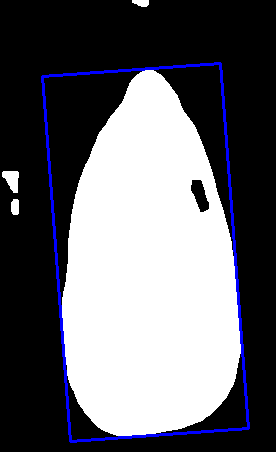

# 新建python环境

```bash
pip3 install python3.10-venv
cd eggplant_car
source eggplant_car_venv/bin/activate 
```
# 安装python环境

```bash
pip3 install ultralytics -i https://pypi.tuna.tsinghua.edu.cn/simple
```

# 下载训练权重并测试语义分割

```bash
python3 test.py
```

# 启动识别

```bash
python3 eggplant_detector/detector.py 
```


> 最大矩形的斜向角度: 85.68397521972656°